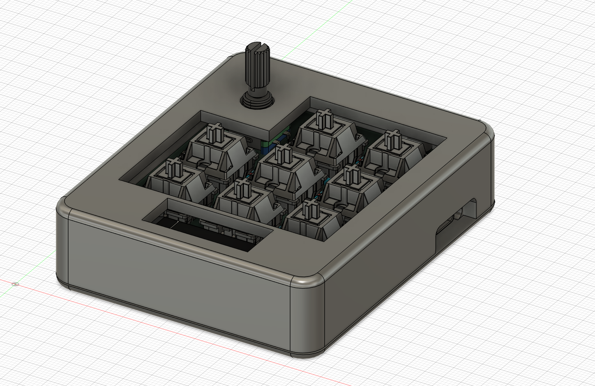
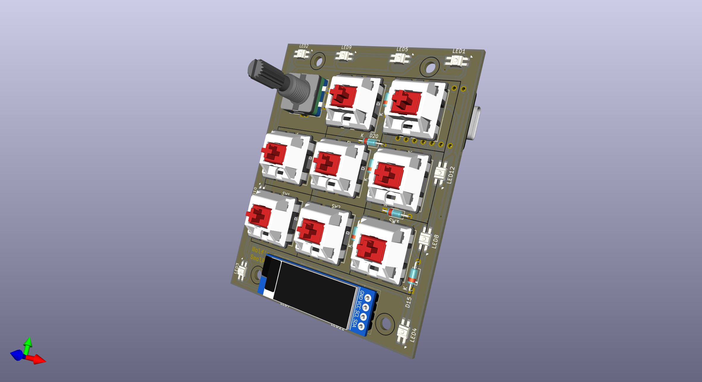

# SmolPad

A slightly customized PCB keyboard with a case. 

Bottom lighting design is inspired by [samdev-7/squarepad](https://github.com/samdev-7/squarepad)

## Bill of material

| Item                   | QTY. |
|------------------------|:----:|
| Seeed Xiao RP2040      | 1    |
| SK6812 mini-e          | 12   |
| MX style switches      | 8    |
| EC11E Rotatory encoder | 1    |
| 0.91' OLED screen      | 1    |
| 1N4148 Diode           | 9    |
